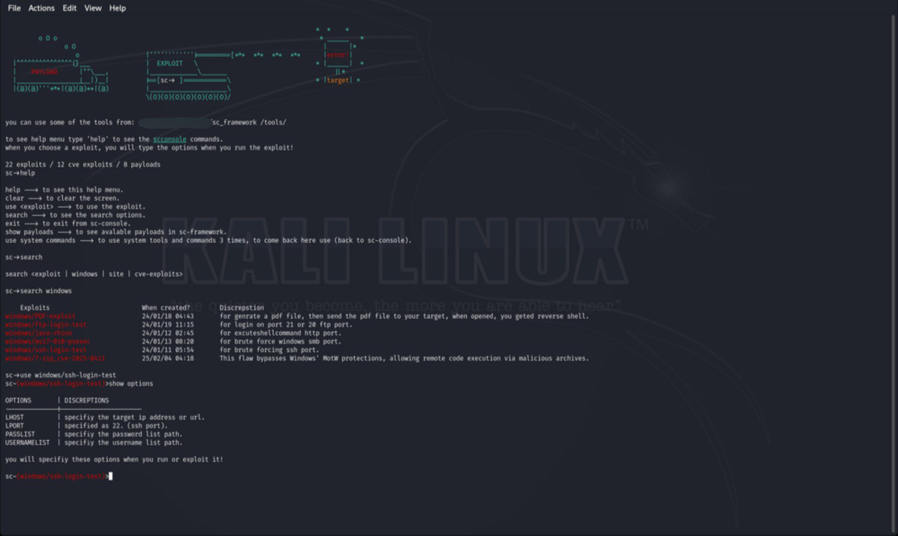
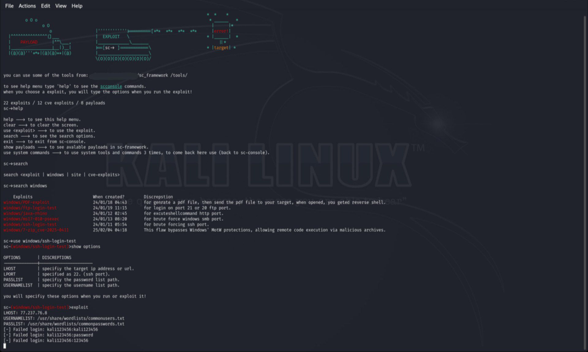

UPDATES
-

new udates and features in sc_framework:

- added 1 new cve-exploits tools.
- added 1 new exploits.
- bugs and errors are fixed.


SC FRAMEWORK
-

this tool uses 22 exploits and 12 cve exploits and 8 payloads.
wich some of the exploit like `ssh-loign-test, PDF-exploit, and more 20 exploits`.

How this tool works?
-

this tool created with python3, first you need to install `requirements.txt` libarys to run this tool
by typing :

```
pip install -r requirements.txt
```

then run it by typing :

```
python scconsole.py
```
or
```
python3 scconsole.py
```

Can we install this tool on system ?
-

yes, we can install the tool by typing :

```
./install
```
or
```
bash install
```

What OS this tool support ?
-

This tool just support linux and macOS.

Commands
-

here the commands of this tool :

in Menu:
```
help ---> to see this help menu.
clear ---> to clear the screen.
use <exploit> ---> to use the exploit.
search ---> to see the options of search.
exit ---> to exit from sc-console.
show payloads ---> to see avalable payloads in sc-framework.
use system commands ---> to use system tools and commands 3 times, to come back here use (back to sc-console).
```
when using an exploit:
```
help ---> to see this help menu.
clear ---> to clear the screen.
unuse ---> to unuse this exploit.
exit ---> to exit from scconsole.
run ---> to run the exploit you selected.
exploit ---> to run the exploit you selected.
show options ---> to see the options.
```
when using an exploit that's have a payload:
```
help ---> to see this help menu.
clear ---> to clear the screen.
unuse ---> to unuse this exploit.
exit ---> to exit from scconsole.
run ---> to run the exploit you selected.
exploit ---> to run the exploit you selected.
show options ---> to see the options.
show payloads ---> to see avalable payloads in sc-framework.
```

here is the photos from sc_framework:







-------------------------------------------------------------------------

Supported platforms (as attacker):
-

- GNU/Linux
- MAC OS X


Supported platforms (as target):
-

- Windows
- Linux
- Mac

-------------------------------------------------------------------------

This tool for educational purposes only! 

Donate
-

BTC: `3J9EmswaqAkzDUz8693MVJ4CqKXzTCM2Vq`

Eth: `0x055aa3c526ad33caec2d1ffbf686ca60071dfe81`

FLO: `FIO6CkKECn61WFE8vbhfQFzuHrk7K9g23NmC8g45nG4kisrbypBHi`

-------------------------------------------------------------------------


```
Malevolent code crawled through cybernetic veins,
consuming every digital defence mechanism In Darkness,
Alone.
No system is safe.
--single core--
```
