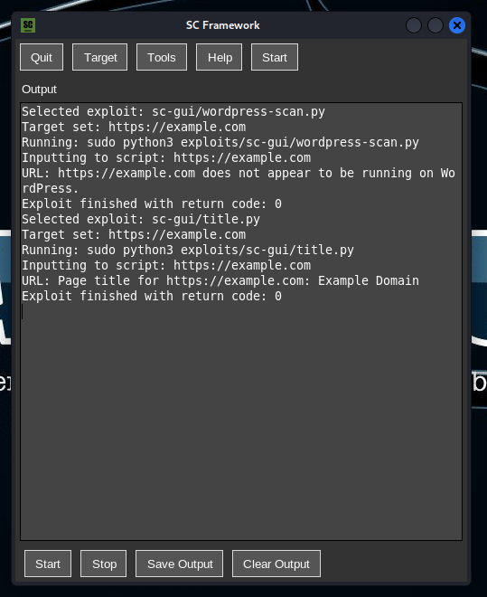

UPDATES
-

new updates and features in sc_framework v1.5:

- added shellcode generator.
- added 2 new exploits.
- added 4 auxiliary exploits.
- added Database (If the exploits dosen't works good, use DataBase to make them ready.).
- fixed the bugs and error.
- added a scanner to scconsole.


SC FRAMEWORK
-

this tool uses 46 exploits and 20 cve exploits and 11 payloads and 16 auxiliary exploits.
which some of the exploit like `ssh-loign-test, PDF-exploit, and more 44 exploits`.

How this tool works?
-

this tool created with python3, first you need to install `requirements.txt` libarys to run this tool
by typing :

```
pip install -r requirements.txt
```

then run it by typing :

```
python scconsole.py
```
or
```
python3 scconsole.py
```

Can we install this tool on system ?
-

yes, we can install the tool by typing :

```
./install
```
or
```
bash install
```

What OS this tool support ?
-

This tool just support linux and macOS.

Commands
-

here the commands of this tool :

in Menu:
```
help ---> to see this help menu.
clear ---> to clear the screen.
use <exploit> ---> to use the exploit.
search ---> to see the options of search.
exit ---> to exit from sc-console.
show payloads ---> to see avalable payloads in sc-framework.
use system commands ---> to use system tools and commands 3 times, to come back here use (back to sc-console).
```
when using an exploit:
```
help ---> to see this help menu.
clear ---> to clear the screen.
unuse ---> to unuse this exploit.
exit ---> to exit from scconsole.
run ---> to run the exploit you selected.
exploit ---> to run the exploit you selected.
show options ---> to see the options.
```
when using an exploit that's have a payload:
```
help ---> to see this help menu.
clear ---> to clear the screen.
unuse ---> to unuse this exploit.
exit ---> to exit from scconsole.
run ---> to run the exploit you selected.
exploit ---> to run the exploit you selected.
show options ---> to see the options.
show payloads ---> to see avalable payloads in sc-framework.
```

-------------------------------------------------------------------------

SC PAYLOAD GENERATOR
-

this tool uses `5` payloads.

the `scpgenerator` (sc payload generator) is a tool for generating `reverse shell payloads`.

here is an example command of scpgenerator:

```
python scgenrate.py -t reverse_tcp -lh <listener_host> -lp <listener_port> -o <output_file>
```


-------------------------------------------------------------------------

SC FRAMEWORK GUI
-



The `GUI` version of scconsole, that created with python, the `GUI` version haves `14 exploits`.

to run the tool, you need to run it as root with sudo, here is the command :

```
sudo python scconsolegui.py
```

and pop up a new window that you can use scconsole as GUI version.

to run an exploit, click on `Tools` bar, then choose type of exploit or attack, then choose an exploit.

and in your terminal that shows you an input to enter your option, so if you look at the `Tools ---> <exploit>`, what does the exploit needs, there is just two : (LHOST and URL)

you need to click on `Tagret` bar to enter your tagret.

and when you typed and clicked on ENTER, and clicked on `start` button or bar, the exploit will runs and shows you the result in the `GUI`.

after you done with your tagret, you can save the results or logs in a path you need as .txt format. here is how :

click on `save logs as...` then the new window pops up, in there you will choose your path and file name to save the result or logs.

-------------------------------------------------------------------------

SC SHELLCODE GENERATOR
-

This tool generates a shellcodes for linux, macos and windows systems.

use this tool to generate a shellcode.

-------------------------------------------------------------------------

What is DataBase in SC Framework ?
-
So sometimes you see the exploits works bad or slow.

so you can use `db_scconsole.py` to make the files and exploits ready to use.

-------------------------------------------------------------------------

How to use db_scscanner in scconsole ?
-

so to use `db_scscanner`, first you need to run scconsole by typing : 

```
python scconsole.py
```

then use these commands : 

```
db_scscanner
db_scscanner -h
db_scscanner -o
db_scscanner -p
db_scscanner -w
db_scscanner results
db_scscanner -n-scan
```

then when you choose your option and type one of these commands, that will ask you for target, ports or port, website, etc.

-------------------------------------------------------------------------

Supported platforms (as attacker):
-

- GNU/Linux
- MAC OS X


Supported platforms (as target):
-

- Windows
- Linux
- Mac
- server
- website

-------------------------------------------------------------------------

This tool is only for educational purposes !

Donate
-

BTC: `3J9EmswaqAkzDUz8693MVJ4CqKXzTCM2Vq`

Eth: `0x055aa3c526ad33caec2d1ffbf686ca60071dfe81`

FLO: `FIO6CkKECn61WFE8vbhfQFzuHrk7K9g23NmC8g45nG4kisrbypBHi`

-------------------------------------------------------------------------

Our Telegram Channel
-

https://t.me/its_Single_Core

join us and use our `tools` and `exploit` our see our new `updates` from `telegram`.

--------------------------------------------------------------------------


```
Malevolent code crawled through cybernetic veins,
consuming every digital defence mechanism In Darkness,
Alone.
No system is safe.
--single core--
```
